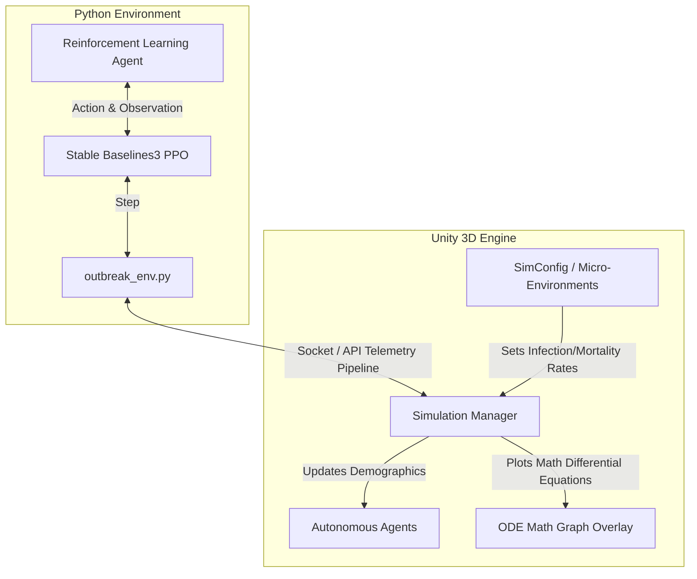
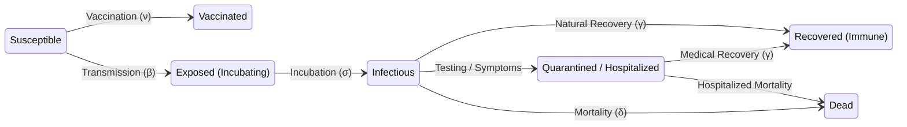

# Project-Aegis-Adaptive-Outbreak-Containment-
Project Aegis: Adaptive outbreak containment for #ROVOTINKERQUEST. Employs Hierarchical Reinforcement Learning (PPO/DQN) to optimize resource allocation under real-world constraints. Features an agent-based SEIR simulation and Atlassian Rovo integration for real-time decision-making and clear epidemiological insights.
[README.md](https://github.com/user-attachments/files/26418861/README.md)
<div align="center">

# 🦠 Adaptive Outbreak Containment
**An Interactive 3D Epidemic Simulation & AI Decision Engine**

[](https://unity.com/) 
[](https://python.org) 
[](https://github.com/DLR-RM/stable-baselines3)

<p align="center">
  <em>Deciding how to intervene effectively under real-world constraints—when every second counts.</em>
</p>

<!-- 🔽 HERO IMAGE / GIF — Replace with actual screenshot or recording -->


</div>

---

## 📖 Table of Contents
- [Problem Statement](#-problem-statement)
- [Expected Outcome](#-expected-outcome)
- [About the Project](#-about-the-project)
- [System Architecture](#-system-architecture)
- [Disease Model (SEIR-DV)](#-disease-model-seir-dv)
- [Development Milestones](#-development-milestones)
- [Tech Stack](#-tech-stack)
- [How to Run](#-how-to-run)
- [What's Next?](#-whats-next)
- [Agent Color Legend](#-agent-color-legend)
- [Simulation Parameters](#-simulation-parameters)
- [Policy Interventions](#-policy-interventions)
- [Code Highlights](#-code-highlights)

---

## 📌 Problem Statement

In infectious disease outbreaks, the primary challenge is not merely predicting how a disease spreads, but **deciding how to intervene effectively under real-world constraints**. Public health systems must operate with **limited vaccines, constrained hospital capacity, delayed and incomplete data, and varying levels of public compliance**.

Current tools largely focus on static modeling or post-hoc analysis, offering limited support for **dynamic, real-time decision-making** in evolving scenarios.

This problem requires the development of a system that simulates a population as an **interactive, evolving environment**, where:
- Individuals interact through a structured network of contacts.
- Disease transmission emerges from these interactions over time.
- Behavioral factors such as mobility and compliance influence outcomes.
- A central decision-making entity allocates limited resources (e.g., vaccines, testing, restrictions).

The objective is to design an **adaptive decision engine** capable of continuously observing partial and imperfect outbreak data, making intervention decisions under uncertainty and constraints, and minimizing infection spread, fatalities, and system overload.

---

## 🎯 About the Project

### ❓ What are we building?
An interactive, 3D agent-based epidemic simulation engine. It models the spread of a pathogen across a diverse population. A central decision-making entity (either a human player or a Reinforcement Learning agent) must deploy limited resources—like vaccines, quarantines, and social distancing mandates—to prevent systemic collapse.

### 💡 Why are we building it?
Static models fall short during live, evolving crises. We need tools that treat outbreak management as a **dynamic control problem**, allowing policy-makers to test and compare intervention strategies interactively and observe downstream emergent behaviors *before* real human lives are at stake.

### ⚙️ How are we building it?
We leverage **Unity (URP)** for high-performance 3D visualization and mathematical tracking, combined with a **Python Reinforcement Learning** backend that trains an AI "Governor" to learn optimal paths for deploying limited interventions under shifting constraints.
---

## 🏗️ System Architecture

Our project is split into two interconnected layers: a high-performance 3D Unity Simulation Engine, and an external Python Reinforcement Learning brain.



| Layer | Technology | Role |
|---|---|---|
| **3D Simulation** | Unity 6 (URP) + C# | Agent movement, city generation, visual rendering |
| **Disease Engine** | `SEIQRModel.cs` | Stochastic SEIQR compartmental transitions |
| **Demographics** | `HealthState.cs` | Age, gender, susceptibility & mortality multipliers |
| **Dashboard UI** | UI Toolkit (UXML/USS) | Real-time telemetry, bar graph, action buttons |
| **RL Brain** | Python + Stable Baselines3 | PPO-based Governor for automated policy decisions |
| **Bridge** | Socket / REST API | Telemetry pipeline between Unity ↔ Python |

---

## 🦠 Disease Model (SEIR-DV)

Our engine utilizes an extended Susceptible-Exposed-Infectious-Recovered (SEIR) continuous time model. This compartmental approach is augmented to include states for hospitalization, intensive care, death (D), as well as a "Vaccinated" (V) status that confers protection.



### 📐 Governing Differential Equations

The continuous-time SEIQRD compartmental model is governed by the following system of ordinary differential equations (ODEs). Let $N = S + E + I + Q + R + D$ denote the total population:

$$\frac{dS}{dt} = -\beta \cdot \frac{S \cdot I}{N} - \nu \cdot S$$

$$\frac{dE}{dt} = \beta \cdot \frac{S \cdot I}{N} - \sigma \cdot E$$

$$\frac{dI}{dt} = \sigma \cdot E - (\gamma + \delta_q) \cdot I$$

$$\frac{dQ}{dt} = \delta_q \cdot I - \gamma \cdot Q$$

$$\frac{dR}{dt} = \gamma \cdot (1 - \mu) \cdot (I + Q) + \nu \cdot S$$

$$\frac{dD}{dt} = \gamma \cdot \mu \cdot (I + Q)$$

#### Variable Definitions

| Symbol | Name | Description |
|---|---|---|
| $S(t)$ | Susceptible | Population not yet exposed to the pathogen |
| $E(t)$ | Exposed | Infected but not yet contagious (latent period) |
| $I(t)$ | Infectious | Actively contagious, can transmit to nearby $S$ agents |
| $Q(t)$ | Quarantined | Isolated (in hospital/building), reduced contact rate |
| $R(t)$ | Recovered | Immune after recovery or vaccination |
| $D(t)$ | Dead | Deceased, permanently removed from the simulation |
| $\beta$ | Transmission rate | Per-contact probability of $S \rightarrow E$ transition |
| $\sigma$ | Incubation rate | Rate of $E \rightarrow I$ progression |
| $\gamma$ | Recovery rate | Rate of $I \rightarrow R$ or $Q \rightarrow R$ transition |
| $\delta_q$ | Quarantine rate | Rate of organic $I \rightarrow Q$ self-isolation |
| $\mu$ | Mortality rate | Probability of death upon recovery attempt |
| $\nu$ | Vaccination rate | Rate of $S \rightarrow R$ via policy intervention |
| $N$ | Total population | $S + E + I + Q + R + D$ (constant) |

### 🎲 Stochastic Discrete-Time Implementation

In practice, the simulation does **not** solve the ODEs numerically. Instead, it uses a **stochastic agent-based** approach where each agent independently undergoes probabilistic state transitions every fixed timestep $\Delta t$:

**Transmission** — For each susceptible agent $i$ with $C_i$ infectious contacts within radius $r$:

$$P(S_i \rightarrow E_i) = 1 - (1 - \beta)^{\,C_i \cdot \Delta t} \;\times\; \alpha_i$$

where $\alpha_i$ is the agent's age-dependent **susceptibility multiplier**.

**Incubation** — Each exposed agent transitions to infectious:

$$P(E_i \rightarrow I_i) = \sigma \cdot \Delta t$$

**Recovery & Mortality** — Each infectious or quarantined agent first rolls for recovery, then for death:

$$P(I_i \rightarrow \text{resolved}) = \gamma \cdot \Delta t$$

$$\text{If resolved: } P(\text{Death}) = \mu \cdot m_i, \quad P(\text{Recovery}) = 1 - \mu \cdot m_i$$

where $m_i$ is the agent's age-dependent **mortality multiplier**.

**Organic Quarantine** — Infectious agents may self-quarantine:

$$P(I_i \rightarrow Q_i) = \delta_q \cdot \Delta t$$

### 👥 Demographic Modifier Functions

Agent risk profiles are assigned based on age $a_i$:

$$\alpha_i = \begin{cases} 1.5 & \text{if } a_i < 12 \text{ (children)} \\ 1.8 & \text{if } a_i > 65 \text{ (seniors)} \\ 1.0 & \text{otherwise (adults)} \end{cases}$$

$$m_i = \begin{cases} 0.5 & \text{if } a_i < 12 \text{ (children)} \\ 2.5 & \text{if } a_i > 65 \text{ (seniors)} \\ 1.0 & \text{otherwise (adults)} \end{cases}$$

**Demographic Modifiers**: Not all agents are equal. The system generates populations with varied ages and genders. Seniors (65+) face a heavily multiplied mortality risk ($$2.5x$$), while children act as highly susceptible latency vectors.

### 🎨 Agent Color Legend

| Color | State | Description |
|---|---|---|
| 🟢 Vivid Green | **Susceptible** | Healthy, can be infected on contact |
| 🟡 Yellow-Orange | **Exposed** | Infected but not yet contagious (incubating) |
| 🔴 Red | **Infectious** | Actively contagious, spreads to nearby agents |
| 🔵 Blue | **Quarantined** | Isolated in a building, reduced transmission |
| ⚪ Grey | **Recovered** | Immune after recovery or vaccination |
| ⚫ Black | **Dead** | Deceased — agent stops moving permanently |

<!-- 🔽 GIF — Replace with a recording showing color transitions during an outbreak -->


### 📊 Simulation Parameters

| Parameter | Symbol | Default | Description |
|---|---|---|---|
| Transmission Rate | β | `0.8` | Probability of infection per contact per tick |
| Incubation Rate | σ | `0.4` | Rate of Exposed → Infectious transition |
| Recovery Rate | γ | `0.05` | Rate of Infectious → Recovered transition |
| Quarantine Rate | δ | `0.02` | Organic self-quarantine probability |
| Mortality Rate | — | `0.05` | Base death probability (modified by demographics) |
| Interaction Radius | — | `2.0` | Distance (units) within which infection can spread |
| Initial Infected | — | `5` | Number of "patient zero" agents at simulation start |
| Initial Budget | — | `$5000` | Starting budget for policy interventions |
| Hospital Capacity | — | `50` | Max quarantined agents the hospital can hold |

---

## 🛠️ Development Milestones

### Milestone 1: Architecting the Underlying SEIR-DV Mathematics & Telemetry
- **The Problem:** We struggled with visualizing the predicted mathematical spread directly in the Unity UI. Modern rendering pipelines completely bypassed our legacy graphing hooks.
- **The Solution:** We completely rewrote the mathematical plotting system to generate a dense 2D Texture on the CPU via pixel-buffer manipulation (`ODEGraph.cs`). This ensured a completely stable UI rendering system across any graphics pipeline and allowed us to draw stacked, semi-transparent area charts of the equations dynamically!

### Milestone 2: Injecting Age, Gender & Vulnerability 
- **The Problem:** Early tests showed the entire population acting as a monolith. The virus either fizzled out instantly or infected everyone immediately.
- **The Solution:** We overhauled `HealthState.cs` to ingest demographic modifiers. We mathematically tied the transmission rate ($$\beta$$) and mortality rate ($$\delta$$) to these groups. Seniors get impacted exponentially harder, while kids act as highly susceptible vectors.

### Milestone 3: Visual Clarity & Spatial Arrangement
- **The Problem:** Initially, the city grid generated massive, dense arrays of physical skyscrapers that obscured the agents, making it chaotic to debug transmission waves.
- **The Solution:** We restricted physical building generation strictly to the perimeter of the field, clearing out a spacious "central plateau" for observation. We further reworked shader colors mapping to the disease states (e.g., Susceptible is neon green, Infectious is pure red, Dead is pitch black), ensuring outbreaks are visually distinct the absolute second they emerge.

---

## 🛡️ Policy Interventions

The simulation provides three real-time policy actions, each with a budget cost:

| Action | Cost | Duration | Effect |
|---|---|---|---|
| 🔒 **Lockdown** | $500 | 5 / 10 / 20 / 30s (selectable) | All agents freeze in place for the chosen duration, then resume |
| 💉 **Mass Vaccination** | $50/agent | Instant | Up to 10 random Susceptible agents become Recovered (immune) |
| 🏥 **Quarantine** | $800 | 15s | All Infectious agents are forced into nearby buildings; healthy agents move freely |


---

## 🧩 Code Highlights

### Disease Transmission Logic (`SEIQRModel.cs`)

```csharp
// Stochastic transmission — each susceptible agent checks nearby infectious contacts
if (agent.CurrentState == InfectionState.Susceptible)
{
    int contactCount = CountInfectiousContacts(agent);
    if (contactCount > 0)
    {
        float transmissionProb = 1f - Mathf.Pow(1f - config.transmissionRate, dt * contactCount);
        transmissionProb *= agent.SusceptibilityMultiplier; // Age-based modifier
        if (Random.value < transmissionProb)
            agent.ChangeState(InfectionState.Exposed);
    }
}
```

### Demographic Assignment (`HealthState.cs`)

```csharp
// Kids (under 12) and Seniors (over 65) have modified risk profiles
Age = Random.Range(5, 90);
AgentGender = (Random.value > 0.5f) ? Gender.Male : Gender.Female;

if (Age < 12) {
    SusceptibilityMultiplier = 1.5f;
    MortalityMultiplier = 0.5f;
} else if (Age > 65) {
    SusceptibilityMultiplier = 1.8f;
    MortalityMultiplier = 2.5f;  // Seniors face 2.5x mortality risk
}
```

### Temporary Lockdown with Auto-Release (`SimulationManager.cs`)

```csharp
// Lockdown automatically lifts after the timer expires
if (lockdownTimer > 0)
{
    lockdownTimer -= Time.fixedDeltaTime;
    if (lockdownTimer <= 0)
    {
        foreach (var agent in model.agents)
        {
            var mov = agent.GetComponent<Movement>();
            if (mov) mov.SetLockdown(false);
        }
        Debug.Log("Lockdown Ended.");
    }
}
```

### Quarantine — Send Infected to Buildings (`Movement.cs`)

```csharp
public void SendToBuilding()
{
    if (CityMapGenerator.BuildingPositions != null && CityMapGenerator.BuildingPositions.Count > 0)
    {
        targetPosition = CityMapGenerator.BuildingPositions[Random.Range(0, CityMapGenerator.BuildingPositions.Count)];
        isQuarantinedInBuilding = true;
        moveXAxis = Random.value > 0.5f;
    }
}
```

---

## 💻 Tech Stack

| Category | Technology |
|---|---|
| **Game Engine** | Unity 6 (Universal Render Pipeline) |
| **Languages** | C# (simulation & UI), Python (RL training) |
| **AI / ML** | Stable Baselines3 (PPO), OpenAI Gym / Gymnasium |
| **Math Modeling** | Numerical ODE Integration (Euler's Method) |
| **UI Framework** | Unity UI Toolkit (UXML + USS) |
| **Architecture** | ScriptableObject config, Modular component-based agents |

---

## 🚀 How to Run

### Running the Unity Simulation
1. Clone this repository.
2. Open the project inside **Unity Hub**.
3. Navigate to `Assets/Scenes` and open the Main Scene.
4. Hit **Play** to watch the autonomous simulated spread immediately generate data on the ODE UI Graph.

### Training the AI Governor
1. Navigate to the `python/` directory.
2. Install dependencies: `pip install -r requirements.txt`
3. Run the training script: `python train_governor.py`
4. The Python environment will establish a connection with the running Unity simulation and begin taking actions (Vaccinate, Lockdown) over thousands of episodes to minimize the outbreak!

<!-- 🔽 SCREENSHOT — Replace with screenshot of the Dashboard HUD in action -->
<p align="center">
  
  <br/>
  <sub><i>Dashboard HUD showing budget, hospital occupancy, epidemic bar graph, and action buttons</i></sub>
</p>
---

## 🔮 What's Next?
- **Graph Neural Networks (GNNs):** Rather than modeling contacts purely by physical proximity, we plan to implement a GNN backend to model familial and workspace topologies.
- **Waning Immunity:** Introducing a temporal decay to the Recovered and Vaccinated states to simulate seasonal re-infections.
- **Extended Hospital Logistics:** Constraining actual physical beds and tracking intensive care utilization independently of general quarantine protocols.
- **Multi-City Networks:** Simulating inter-city travel with separate population clusters connected by transit links.
- **Contact Tracing:** Logging agent interaction history to enable targeted retroactive quarantine strategies.

---

<div align="center">

<!-- 🔽 SCREENSHOT — Replace with a wide shot of the running simulation -->
<p align="center">
 
  <sub><i>400 agents navigating a procedurally generated city with buildings, barriers, and grid-based streets</i></sub>
</p>

**Made with ❤️ for #ROVOTINKERQUEST**

</div>
